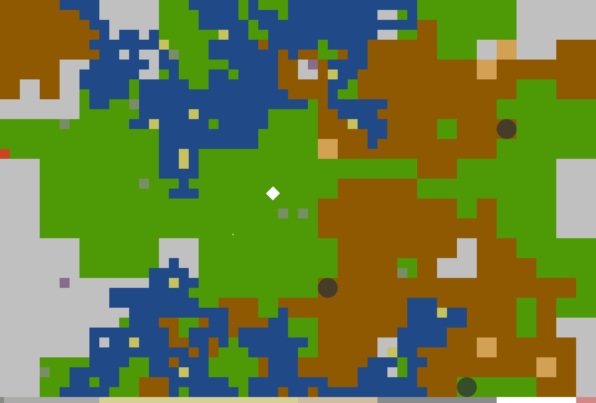

# World of Pixel

Je to jenom přesně uspořádaná matice malých pixelů, které dokáží zářit v celé šíři spektra oslnivých barev. Menších, než lidské oko svede na první pohled rozlišit a přitom tak mocných. Však je jenom na tobě, jaký jim dáš význam. Jest-li se hned za blikajícím kurzorem promění v první písmeno srdce rvoucího románu, dokonalý obraz tvořený rukou vedenou poetického umělce, nebo se stanou dalším řádkem instrukcí v programovém kódu složitého algoritmu, či jeho poslední tečkou.

Představ si náhodně generovanou krajinu, kterou můžeš prost všech myšlenek náhodně procházet. Po zelených pláních pobíhají nenápadní zajíci. V hustých lesích se ukrývají čokoládoví koloušci. Řeky jsou plné zlatých rybek. Z oblohy se promítají stíny poletujících ptáků a v prázdnotě poskakují kouzelné žáby. Tvým jediným společníkem je zrzavá lištička, která se zatoulala malému princi a snad jen z nudy honící ony zajíce.

Hrdinou počítačové hry jsi osamělý indián s osmi šípy ve svém toulci. Opakovanou střelbou na zajíce zlepšuješ své dovednosti až k dokonalosti. Rybolov tě nejen nasytí, ale také dodá odvahu vstoupit do studených vod. Po skolení krále jelenů ti lesní duch dovolí vkročit do jeho království. Z peří dostatečného počtu sestřelených ptáků si můžeš poskládat křídla, která ti pomohou překonat i prázdný prostor obývaný vzácnými, leč neposednými žábami.

Každé stvoření má svou cenu, za jejich ulovení získáš body, pokud ti ovšem dříve neuteče přes okraj (pak je ztrácíš), který ty však můžeš volně přecházet kudy zrovna vede cesta. Pohybuj se o krok pomocí kláves `a`, `d`, `w` a `s`, tj. *doleva*, *doprava*, *nahoru* a *dolů*, nebo skákej spolu s klávesou `Shift`. Střílet můžeš do všech směrů (i najednou ;-) na numerické klávesnici. Pamatuj, že každý z tvorů má taky jiný počet životů. Hra neskončí, dokud je s tebou lištička, tak se ji snaž mockrát (ne)chtěně (ne)zasáhnout, nebo dokud nedojdeš na její konec.

Začni klávesou `Enter`. Nový svět, až ten původní vypleníš, získáš zmáčknutím `Backspace`. Ze začátku své dovednosti musíš získat pokaždé znovu, až postupem času se stanou permanentní. Pokud ti něco není jasného, hledej odpověď ve zdrojovém kódu. K jeho spuštění budeš potřebovat prostředí [Processing](https://processing.org/), které oceníš i při dalších modifikacích hry, nebo vytváření vlastních originálních projektů. Každopádně buď zodpovědný/á a nepodléhej prokrastinaci. 